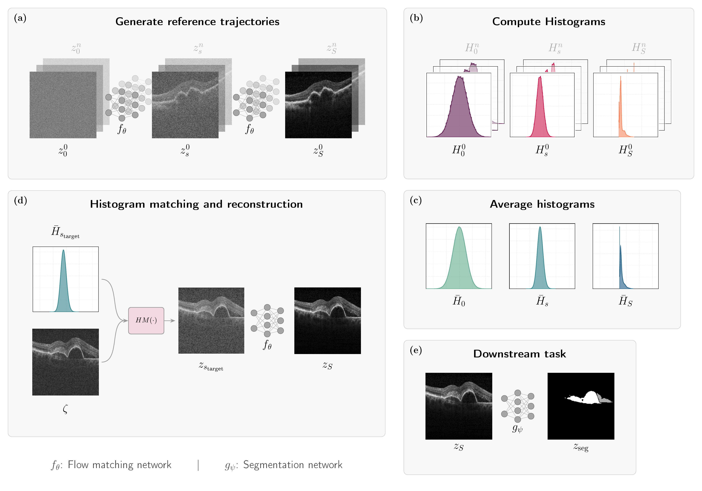

# TTA-Flow: Test-Time Adaptation in Optical Coherence Tomography Using Trajectory-Aligned Time-Independent Flow

TTA-Flow is a test-time adaptation framework for cross-device reconstruction of optical coherence tomography (OCT) images. It leverages a generative Flow Matching model trained on volumetric OCT data to adapt unseen images from a new imaging device — without any retraining.



## Method

TTA-Flow operates in two stages:

1. **Reference trajectory extraction (offline):** The trained flow matching network $f_\theta$ generate $n$ clean data samples $z_S^n$ along with the ODE trajectories. Intensity histograms are computed and averaged at each trajectory step, producing a set of reference histograms $\{\bar{H}_0, \bar{H}_s, \bar{H}_S\}$.

2. **Test-time adaptation (online):** Given a new unseen image $\zeta$ from a (noisy) target domain, its intensity distribution is aligned with an intermediate point along the reference trajectory using histogram matching. The ODE integration is then started from that point, reconstructing a source domain image $z_S$ that can be passed to a downstream task (e.g. segmentation with $g_\psi$).

The model backbone is a UNet trained with the standard flow matching regression loss on 2D slices extracted from 3D OCT volumes.

## Data

Experiments use the [RETOUCH dataset](https://retouch.grand-challenge.org/), which contains volumetric OCT scans from three imaging devices: **Spectralis**, **Cirrus**, and **Topcon**.

Data should be organized as follows, with volumes and annotations saved as `.npy` NumPy arrays:

```
/path/to/retouch/
├── volumes/
│   ├── image_001.npy       # 3D volume (D, H, W)
│   └── ...
└── annotations/
    ├── mask_001.npy        # 3D binary mask (D, H, W)
    └── ...
```

Each dataset split is defined by a CSV file in `data/dataset_configs/`:

```csv
volume,mask
volumes/image_001.npy,annotations/mask_001.npy
```

The `mask` column is optional and only required for downstream segmentation evaluation (Dice). Pre-configured splits for all three devices are provided as `retouch_spectralis`, `retouch_cirrus`, and `retouch_topcon`.

## Setup

**Prerequisites:** Docker with NVIDIA GPU support, CUDA 12.6+.

```bash
docker build -t tta-flow:latest .
```

For local development without Docker:

```bash
python3.12 -m venv venv && source venv/bin/activate
pip install -r requirements.txt
```

## Training

Train a flow matching model on a given device dataset:

```bash
docker run -it --rm --gpus all \
  --user $(id -u):$(id -g) \
  -v /path/to/retouch:/app/data/retouch \
  -v $(pwd)/data/dataset_configs:/app/data/dataset_configs \
  -v $(pwd)/runs:/app/runs \
  tta-flow:latest \
  bash src/train.sh retouch_spectralis my_experiment_name
```

All hyperparameters are managed via [Hydra](https://hydra.cc/) configuration files in `preferences/`. Any parameter can be overridden directly from the command line, for example:

```bash
bash src/train.sh retouch_spectralis my_experiment_name \
  train_parameters.num_steps=50000 \
  optimizer.lr=1e-4
```

Outputs are saved to `runs/{timestamp}-{experiment_name}/`, containing model checkpoints and TensorBoard logs.

## Inference

Run inference with a trained checkpoint:

```bash
docker run -it --rm --gpus all \
  --user $(id -u):$(id -g)
  -v /path/to/retouch:/app/data/retouch \
  -v $(pwd)/data/dataset_configs:/app/data/dataset_configs \
  -v $(pwd)/runs:/app/runs \
  tta-flow:latest \
  bash src/inference.sh runs/{experiment_dir} retouch_cirrus
```

Reconstructed volumes are saved as `pred_*.npy` under `{experiment_dir}/inference/outputs/`.

## Repository Structure

```
├── src/
│   ├── train.py / test.py          # Training and inference entry points
│   ├── train.sh / inference.sh     # Shell wrappers
│   ├── models/                     # UNet model definition
│   └── util/                       # Datasets, losses, metrics, checkpointing
├── preferences/                    # Hydra YAML configuration files
├── runs/                           # Training logs and outputs
├── data/
│   └── dataset_configs/            # CSV files defining dataset splits
├── notebooks/                      # Exploratory notebooks
├── Dockerfile
└── requirements.txt
```